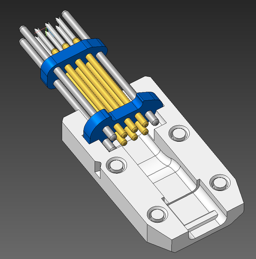

# DIY TC2030 probe

## BOM
| Part                          | Qty   |
| ------------------------------|-------|
| Bottom PCB **1.2mm**          | 1pc   |
| Top PCB **1.2mm**             | 1pc   |
| P50-Q1 pogo pin               | 6 pcs |
| Steel paper clip 0.8mm wire   | 3 pcs |
| Heat-shrink tubing 4.5mm      | 15 mm |
| Heat-shrink tubing 6mm        | 6mm   |
| AWG28 stranded wire 1.3mm OD  | 6 pcs |
| Case                          | 1 pc  |
| CA glue                       | some  |

## PCBs
There are two options:
1. Both PCBs on one panel in the Gerber directory.
2. Each PCB on its own in Gerber/{top,bottom} directories.

## Case
TC2030-DIY-case.stl is a multipart file.  
Split to objects and print case halves with the flat sides facing the bed. Cover is printed with the lock side facing the bed.

## Assembly

Suggested dimensions:

**Bottom PCB side with mask opening facing the case.**  
1. Solder steel (not stainless) paper clip pieces as the guides.  
Better to cut some extra length and after soldering trim to the desired
length on both sides.  
2. Make bevels on the guide ends for easy insertion.
3. Solder pogo pins. Use suitable spacer to line up the pins.  
4. Strip 2mm of insulation from the wires, twist and tin.  
5. Run stripped side of the wires through 4.5mm Heat-shrink tubing and the top PCB, then solder to the bottom PCB pads.  

6. Adjust the heat-shrink to the case top cutout and shrink.  
7. Insert the assembly into one half of the case; apply CA glue to the case pegs, put on second half, gently squeeze the thing in a vise, and let the glue to cure.
8. Put 6mm heat-shrink tubing over bottom PCB and wire joints, then shrink.
9. Terminate other ends of the wires as your flavor.  

Done.
